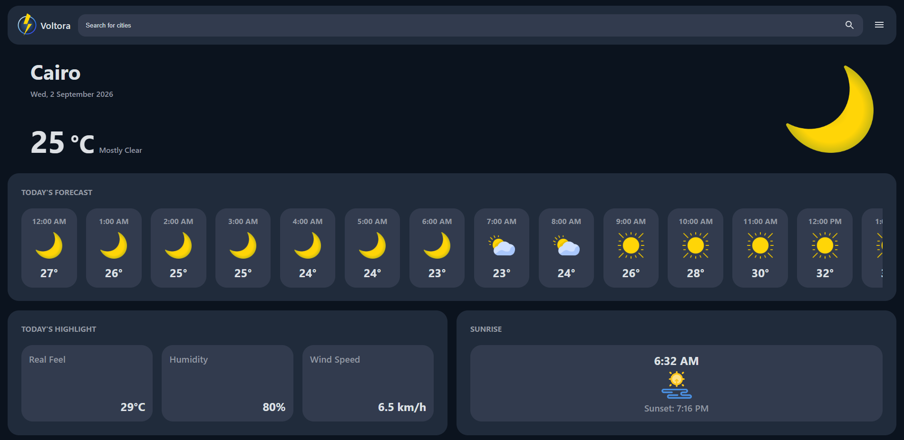
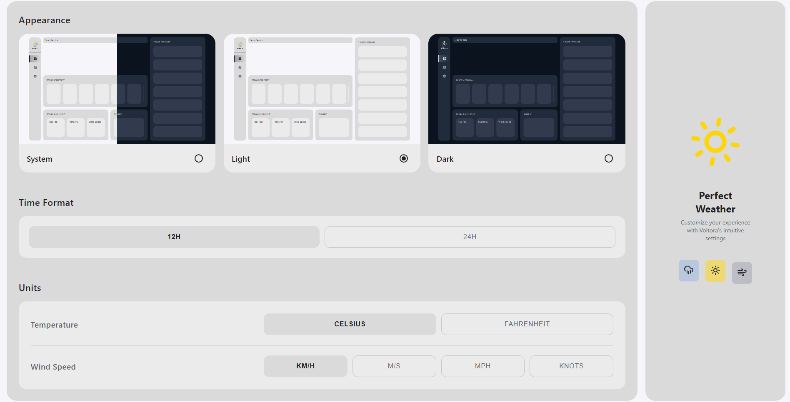

# Voltora 🌤️

Voltora is a responsive weather application built with React that provides real-time weather information for selected cities, including current conditions, hourly forecasts, weekly forecasts, weather highlights, and sunrise/sunset times.

## 📸 Screenshots





## ✨ Features

- Real-time weather information for selected cities
- Current temperature and weather conditions
- Hourly and weekly forecasts
- Weather highlights including humidity, apparent temperature, and wind speed
- Sunrise and sunset information
- City search and selection
- Save and manage favorite cities using browser local storage
- Celsius/Fahrenheit temperature units
- Multiple wind-speed units
- 12-hour and 24-hour time formats
- Light, dark, and system theme support
- Responsive and component-based interface

## 🛠️ Tech Stack

- React
- JavaScript
- React Router
- Material UI
- Axios
- CSS
- Open-Meteo API
- Browser Local Storage

## 🏗️ Architecture

The application is organized into reusable React components and Context providers.

Weather data is fetched through the Open-Meteo API and managed centrally using React Context. Separate contexts are used for weather data, application settings, search functionality, and saved cities.

This structure keeps the UI components focused on presentation while centralizing application state and API-related logic.

## 🚀 Getting Started

### Prerequisites

- Node.js
- npm

### Installation

Clone the repository and install the dependencies:

```bash
git clone https://github.com/ahmedzeyad67/voltora.git
cd voltora
npm install
npm start
```

The application will be available at:

```text
http://localhost:3000
```

## 🌐 API

Voltora uses the [Open-Meteo API](https://open-meteo.com/)
to retrieve weather and forecast data.
